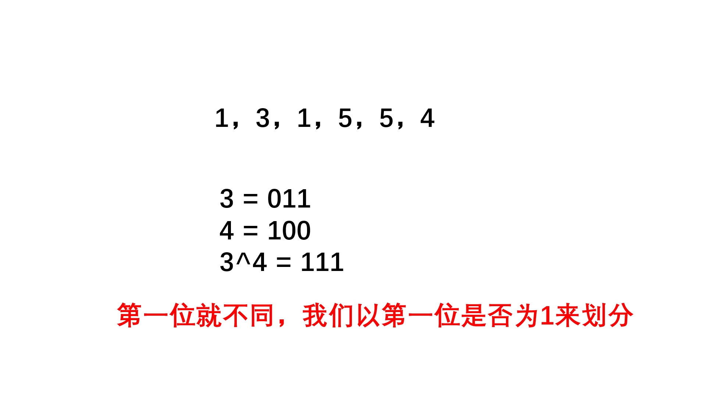

[返回](./index.md)

## 哈希类

### 1. 两数之和

给出一个整型数组 numbers 和一个目标值 target，请在数组中找出两个加起来等于目标值的数的下标，返回的下标按升序排列。
（注：返回的数组下标从 1 开始算起，保证 target 一定可以由数组里面 2 个数字相加得到）

要求：空间复杂度 O(n)，时间复杂度 O(nlogn)

[3,2,4],6

#### 示例 1

```
输入：[3,2,4],6
返回值：[2,3]
说明：因为 2+4=6 ，而 2的下标为2 ， 4的下标为3 ，又因为 下标2 < 下标3 ，所以返回[2,3]
```

#### 示例 2

```
输入：[20,70,110,150],90
返回值：[1,2]
说明：20+70=90
```

分析：
这题一看是哈希题型，必须想到 map，只要两者之和恰好等于目标值的下标，又用到哈希，嘿嘿，哈希存什么最省？存差值，一次循环搞定：

```javascript
function twoSum(numbers, target) {
  const length = numbers.length;
  const oMap = new Map();
  for (let i = 0; i < length; i++) {
    let less = target - numbers[i];
    if (!oMap.has(less)) {
      // 如果插值不在map内，则把当前值存入map
      oMap.set(numbers[i], i + 1);
    } else {
      // 差值存在map内，说明已找到，直接返回
      return [oMap.get(less), i + 1];
    }
  }
  return [];
}
```

### 2. 数组中只出现一次的两个数字

一个整型数组里除了两个数字只出现一次，其他的数字都出现了两次。请写程序找出这两个只出现一次的数字

示例 1：

```
输入：[1,4,1,6]
返回值：[4,6]
说明：返回的结果中较小的数排在前面
```

示例 2：

```
输入：[1,2,3,3,2,9]
返回值：[1,9]
```

解决方案 1：构建哈希，重复的+1

```javascript
function FindNumsAppearOnce(array) {
  // write code here
  const len = array.length;
  const obj = new Map();
  for (let i = 0; i < len; i++) {
    const item = array[i];
    if (obj.get(item) !== undefined) {
      obj.set(item, obj.get(item) + 1);
      if (obj.get(item) === 2) {
        obj.delete(item);
      }
    } else {
      obj.set(item, 1);
    }
  }
  return Array.from(obj.keys()).sort((i, j) => i - j);
}
```

这种方案虽然能得到正确答案，但是不满足空间复杂度为 O(1)，还有一种方案：
异或运算符，其思路：

异或运算满足交换率，且相同的数字作异或会被抵消掉，比如：a⊕b⊕c⊕b⊕c=a，且任何数字与 0 异或还是原数字，放到这个题目里面所有数字异或运算就会得到 a⊕b，也即得到了两个只出现一次的数字的异或和。\

```
//遍历数组得到a^b
for(int i = 0; i < array.length; i++)
    temp ^= array[i];
```

但是我们是要将其分开得到结果的，可以考虑将数组分成两部分，一部分为 a⊕d⊕c⊕d⊕c=a，另一部分为 b⊕x⊕y⊕x⊕y=a 的样式，怎么划分才能让 a 与 b 完全分开，而另外的也能刚好成对在一个组呢？这是我们需要考虑的问题。

a⊕b 的结果中如果二进制第一位是 1，则说明 a 与 b 的第一位二进制不相同，否则则是相同的，从结果二进制的最高位开始遍历，总能找到二进制位为 1 的情况：

```
//找到两个数不相同的第一位
while((k & temp) == 0)
    k <<= 1;
```

因为两个数字不相同，我们就以这一位是否为 1 来划分上述的两个数组，相同的数字自然会被划分到另一边，而 a 与 b 也会刚好被分开。

```
//遍历数组，对每个数分类
if((k & array[i]) == 0)
    res1 ^= array[i];
else
    res2 ^= array[i];
```

具体做法：

step 1：遍历整个数组，将每个元素逐个异或运算，得到 a⊕b。\
step 2：我们可以考虑位运算的性质，找到二进制中第一个不相同的位，将所有数组划分成两组。\
step 3：遍历数组对分开的数组单独作异或连算。\
step 4：最后整理次序输出。

如图：


代码：

```javascript
function FindNumsAppearOnce(array) {
  // write code here
  const len = array.length;
  let res1 = 0;
  let res2 = 0;
  let temp = 0;
  //遍历数组得到a^b
  for (let i = 0; i < len; i++) {
    temp ^= array[i];
  }
  let k = 1;
  //找到两个数不相同的第一位
  while ((k & temp) == 0) {
    k <<= 1;
  }
  for (let i = 0; i < len; i++) {
    //遍历数组，对每个数分类
    if ((k & array[i]) == 0) {
      res1 ^= array[i];
    } else {
      res2 ^= array[i];
    }
  }
  //整理次序
  if (res1 < res2) {
    return [res1, res2];
  } else {
    return [res2, res1];
  }
}
```

[返回](./index.md)
