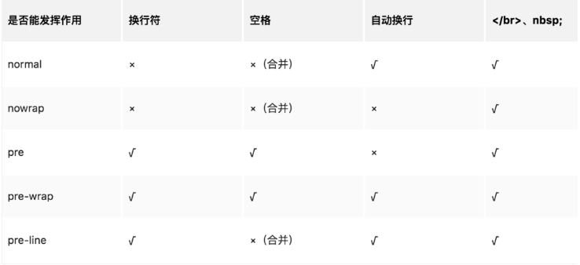

[返回](./css.md)

## 1. HTML 语义化

语义化标签、利于页面内容结构化、利于无 CSS 页面可读、利于 SEO、利于代码可读 标准回答 HTML 语义化就是指在使用 HTML 标签构建页面时，避免大篇幅的使用无语义的标签。

语义化的好处：1. 代码可读高 2. 有利于 SEO 3. 利于页面内容结构化 常见的语义化标签：header、footer、aside、main、h1-h6、input、textarea、video、aduio

## 2. 未知宽高元素水平垂直居中方法

方法 1： 父级弹性布局

```css
display: flex;
justify-content: center;
align-items: center;
```

方法 2： 要求父级 position: relative;

```css
position: absolute;
left: 50%;
top: 50%;
transform: translate(-50%, -50%);
```

方法 3： 父级 display: grid

```css
display: grid;
justify-content: center;
align-items: center;
```

方法 4： 父级 display: grid, 子 display: table-cell;这个时候子铺满整个父级，子的子级就垂直水平居中了

```html
<div
  style="
    width: 100%;
    height: 500px;
    border: 1px solid #e243;
    display: table;
  "
>
  <div
    style="display: table-cell; text-align: center; vertical-align: middle"
  >
    <span
      style="
        background-color: red;
        display: inline-block;
        width: 100px;
        height: 50px;
        border: 1px solid #e243;
      "
    ></span>
  </div>
</div>
```

## 3. 背景显示特效
```css
background-image: radial-gradient(transparent 1px,var(--bg-color) 1px);
backdrop-filter: saturate(50%) blur(4px);
```

## 4. white-space word-break word-wrap三者的区别

先看三者的参数及展示的效果都有哪些

white-space: normal|nowrap|pre|pre-wrap|pre-line\
white-space主要是控制空白符和是否自动换行，用一张图解释：\


word-break: normal|break-all|keep-all\
word-break主要是控制单词如何拆分换行的

word-wrap: 又称 overflow-wrap，参数为：normal|break-word\
因为word-break容易导致英文单词被强制换行，所以使用word-wrap可以避免单词被分行了

[返回](./css.md)
